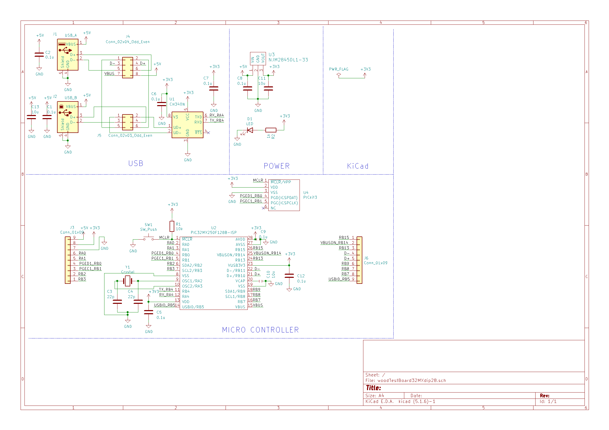
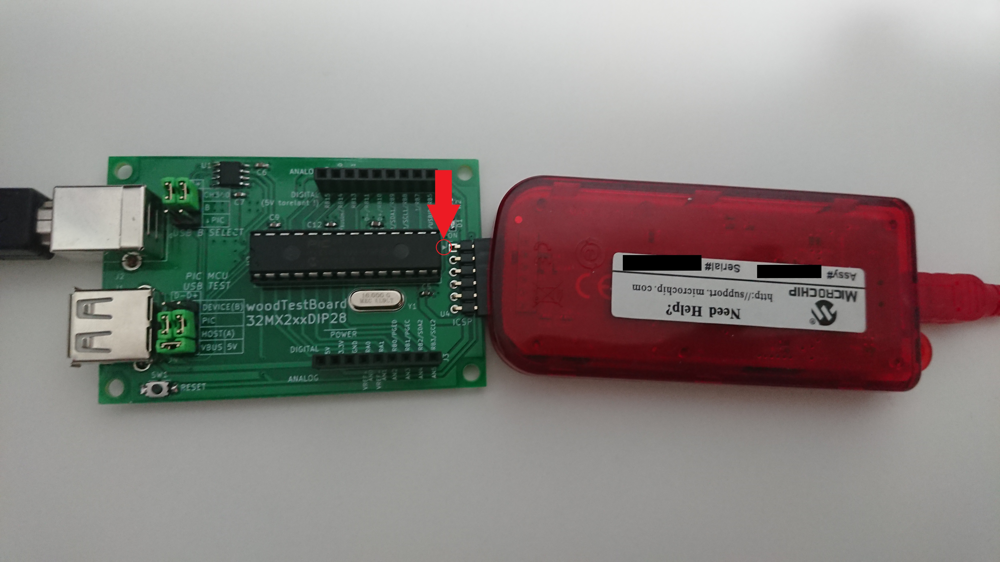

# woodTestBoard32MXdip28

PIC32MX2xxのDIP28ピンマイコンの評価ボードです。「お手軽DIPマイコンのPIC32MXを始めよう(仮称)」に対応しています。

BOOTH(https://woodrobo.booth.pm/items/3751749)で販売しています。

  

  

## USBピンヘッダについて  
USBコネクタの近くに2つピンヘッダがついていると思います。これはUSB関連の接続をするためものです。単純な回路ですので詳細は回路図をご覧ください。  
  
USB B SELECT  
USB Bコネクタ(パソコンと接続する時のコネクタ)のUSB通信線(D+,D-)の配線をすることができます。B-CH340で接続すればUSBシリアル変換ICを利用することができます。(ArduinoでいうSerial.printでパソコンに文字を表示できるようになる)B-PICで接続すれば下にあるPIC MCU USB TESTのDEVICE(B)に配線をつなげることができます。  
  
PIC MCU USB TEST  
PICマイコンのUSB関連の配線をすることができます。PIC-DEVICE(B)で接続＆USB B SELECTでB-PICで接続すればPICをUSB Bコネクタに繋げられUSB DEVICE機能を試すことができます。PIC-HOST(A)で接続すればUSB Aコネクタに繋げられUSB HOST機能を試すことができます。  
VBUS-5VはUSBモジュール使用の時に必要になることがあるので繋げておいてください。	  
  
# 書き込みについて  
ボード右側にあるICSP用ピンヘッダは 写真のように三角マークがあるピンがMCLRです。書き込み器には同じように三角マークがあるので三角マーク同士を合わせるように接続してください。例えばPickit3では写真のように書き込み器の裏面が見えるような向きになると思います。  
  
  

# 部品について

(はんだづけする際に見る)部品表や(部品を購入する際に見る)部品個数表はadd_infoフォルダを見てください。  
価格は1部品あたりの値段を計算していますので複数個入りで販売されている部品に関しては購入金額はこれよりも高くなります。  
チップ部品セットとがBoothで販売しているチップコンデンサ、抵抗、LEDがセットになったものです。

# はんだづけ

向きを間違えやすい箇所を説明します。

U1のCH340は上下2つある白線のうち伸びている箇所(左上)がピン1です。そのため写真のような向きではんだづけしてください。

  
  
D1のチップLEDは写真のような向きです。チップLEDの裏面のほうが分かりやすいため裏面にしたLEDも横に並べています。

  